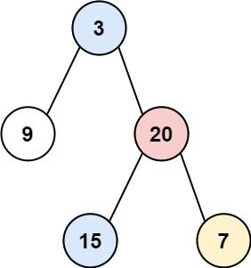
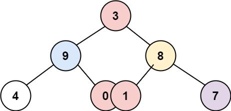
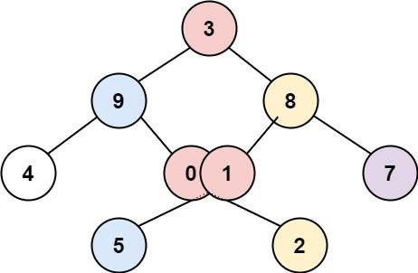

**[PlayGround 🔒](https://leetcode.cn/problems/binary-tree-vertical-order-traversal)**

Difficulty <mark>Medium</mark>

Description


Given the root of a binary tree, return the vertical order traversal of its nodes' values. (i.e., from top to bottom, column by column).

If two nodes are in the same row and column, the order should be from left to right.

Example 1:


```
Input: root = [3,9,20,null,null,15,7]
Output: [[9],[3,15],[20],[7]]
```
Example 2:




```
Input: root = [3,9,8,4,0,1,7]
Output: [[4],[9],[3,0,1],[8],[7]]
```
Example 3:




```
Input: root = [3,9,8,4,0,1,7,null,null,null,2,5]
Output: [[4],[9,5],[3,0,1],[8,2],[7]]
```

**Constraints:**

- `The number of nodes in the tree is in the range [0, 100].`
- `-100 <= Node.val <= 100`