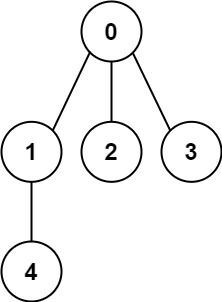

**[PlayGround](https://leetcode.com/problems/graph-valid-tree/)**

**[PlayGround](https://www.lintcode.com/problem/178/)**

You have a graph of n nodes labeled from 0 to n - 1. You are given an integer n and a list of edges where edges[i] = [aᵢ, bᵢ] indicates that there is an undirected edge between nodes aᵢ and bᵢ in the graph.

Return true if the edges of the given graph make up a valid tree, and false otherwise.

Example 1:


```
Input: n = 5, edges = [[0,1],[0,2],[0,3],[1,4]]
Output: true
```

Example 2:


```
Input: n = 5, edges = [[0,1],[1,2],[2,3],[1,3],[1,4]]
Output: false
```

**Constraints:**

- `1 <= n <= 2000`
- `0 <= edges.length <= 5000`
- `edges[i].length == 2`
- `0 <= ai, bi < n`
- `ai != bi`
- `There are no self-loops or repeated edges.`